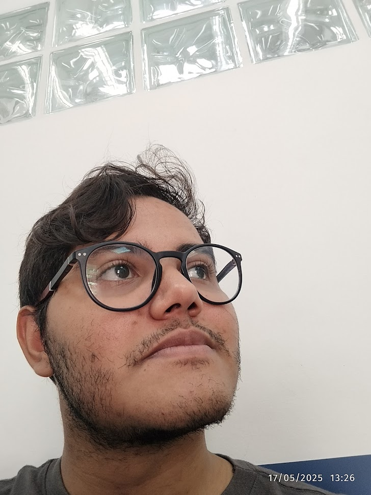

# luisr-1

Hi, there! My name is Luis. I'm currently a Computer Science student at UFABC. My hobbies are listening to music and traveling wherever I can afford to go (I need money!). I primarily focus on Backend development (Web APIs), and I'm currently expanding my knowledge into System Programming.

---

**My stack:**

---

---

