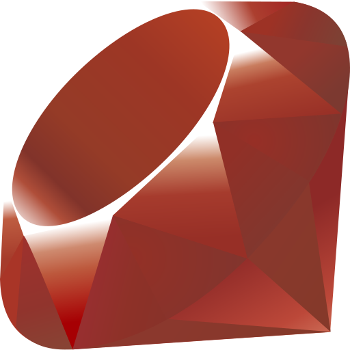

# luisr-1

<table>
  <tr>
    <td>
      
Hi, there! My name is Luis. I'm currently a Computer Science student at UFABC. My hobbies are listening to music and traveling with my loved girlfriend wherever we can afford to go (We need money!).

      
I primarily focus on Backend development (Web APIs), and I'm currently expanding my knowledge into System Programming.

    </td>
    <td align="right">
      
    </td>
  </tr>
</table>

---

### My Stack:

<section style="display: flex; flex-direction: column; border: 1px solid black; padding: 10px;">
    &nbsp;
    &nbsp;
    &nbsp;
    &nbsp;
    &nbsp;
    &nbsp;
    
</section>

---

---

